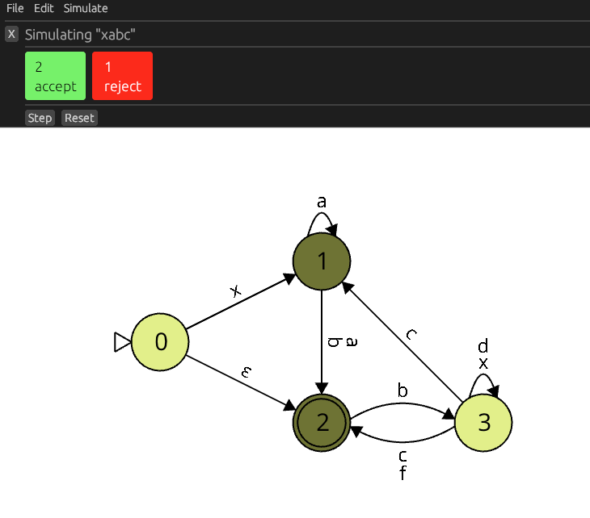

# Sugarcubes
https://henryksloan.github.io/sugarcubes/

Sugarcubes is a library and application for automata and formal languages. It is inspired by JFLAP, and is intended to eventually to be an alternative to JFLAP.



### Usage
Double-click the background to add a state.  
Double-click a state and drag onto another state (or the same state) to add a transition.   
Click and drag a state to move it.
Right click a state for more options, such as deleting it or making it initial or final.
Right click a transition symbol for more options, like deleting it.

## Building
To build the desktop frontend, run:

`cargo run --release`

### WASM
To build for WASM, run:

```
# Add the WASM compilation target if you haven't already
rustup target add wasm32-unknown-unknown

cargo build --release --target wasm32-unknown-unknown
```

This will produce a WASM binary in `target/wasm32-unknown-unknown/release/sugarcubes.wasm`, which can be placed in the `docs` directory and hosted as described [in the miniquad docs](https://github.com/not-fl3/miniquad/#wasm).

# Progress
Sugarcubes is in an early stage of development, having support for editing and simulating finite automata. The first MVP will be a fully usable finite automaton simulator and editor.

## Next steps
* Usable FA edit mode
    * State labels
    * Keyboard shortcuts for context menu operations
    * Multiple select mode
        * Click-drag starting on the background
        * Movement and deletion of multiple objects
* Simulation rewinding (this may require some sophistication to avoid combinatoric memory usage)
* Under consideration
    * Implement undo/redo for moving
    * Editing transitions with the context menu

## Eventual goals
* More automata
    * Push-down automata
    * Turing machines
    * Possibly others like Mealy machines and Moore machines
* Filetype-compatility with JFLAP
    * Can be implemented incrementally, per-model type
* Regular expressions and grammars
* Operations and conversions like minimization
* Graph visual organization like alignment
* Turing machine blocks
* Built-in tutorials

## Stretch goals/pipe dreams
* Collaborative editing
* Generating URLs of models for easy sharing
* Potentially a custom file format for features not present in JFLAP
